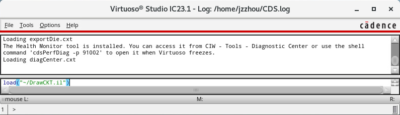
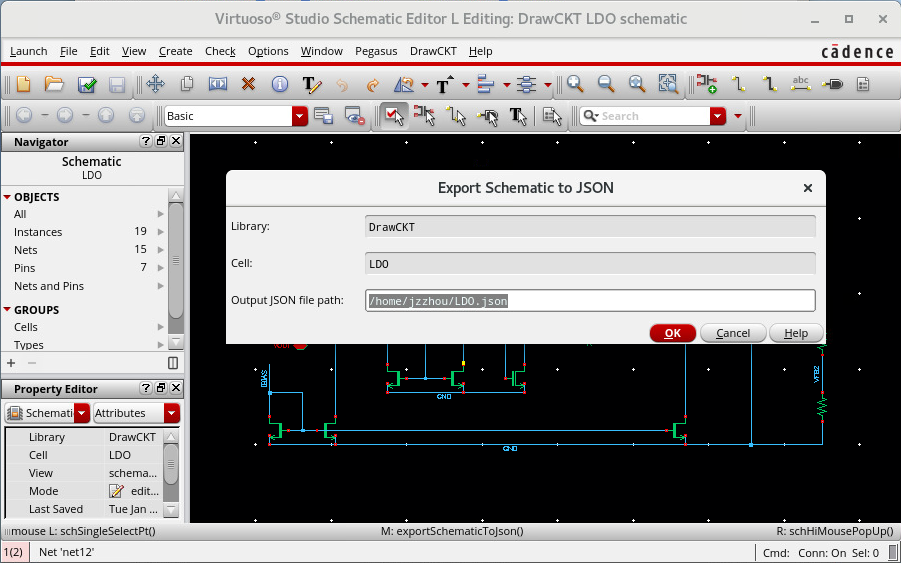
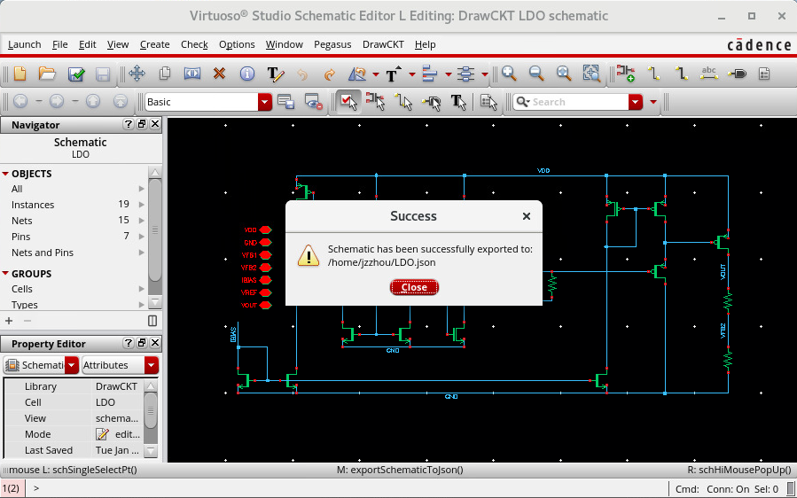
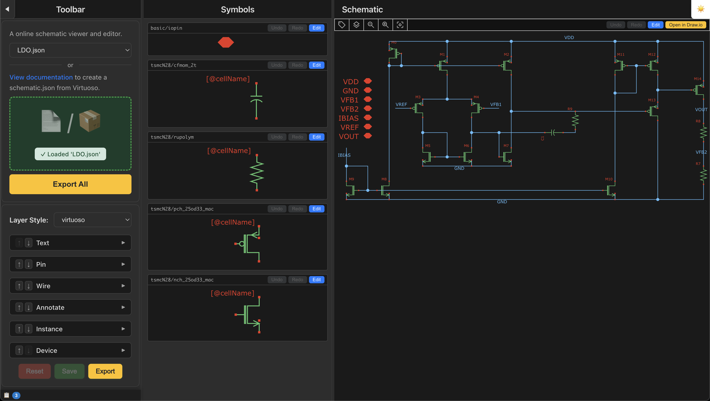

# DrawCKT

## Export `schematic.json` from virtuoso

1. Download [DrawCKT.il](DrawCKT.il) to `path/to/DrawCKT.il`

2. Run `load("path/to/DrawCKT.il")` in virtuoso command shell to import our tool:

3. When you open scheamtic view, there should be a **DrawCKT** button in menu bar, click it:

4. Type the path of output json file:

5. You will see the success message!

6. Upload json file here
